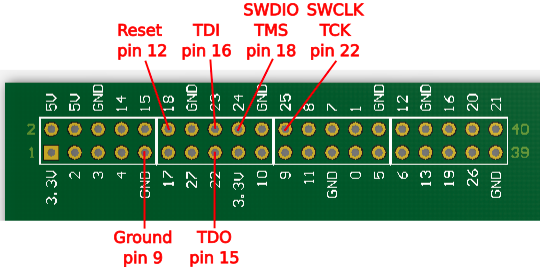
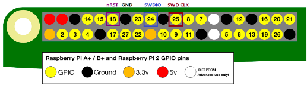

# OpenOCD
## Info about this file
- How to configure OpenOCD on Raspberry Pi and on Ubuntu with ST-Link v2
- How to flash `.hex` file to nRF52 with RPi and ST-Link v2
- How to unlock *AP protection* (Access Port)

- [OpenOCD repository](https://sourceforge.net/p/openocd/code/ci/master/tree/)
## Raspberry Pi
1. `sudo apt-get update`
2. Install all the tools you'll need to compile OpenOCD:
   `sudo apt-get install git autoconf libtool make pkg-config libusb-1.0-0 libusb-1.0-0-dev`
3. Download the latest source code for OpenOCD: `git clone git://git.code.sf.net/p/openocd/code openocd-code`
   > OpenOCD changes a lot and is under constant development so we do suggest compiling your own!
4. Change into the code directory and run the bootstrapper: `cd openocd-code && ./bootstrap`
5. Next, we will compile OpenOCD with the Raspberry Pi native GPIO twiddling support -
   this will work on various Raspberry Pi's despite being called *bcm2835gpio*:
   `./configure --enable-sysfsgpio --enable-bcm2835gpio`
6. `make`
7. `sudo make install`

   If something goes wrong commit: `9d3f33757030c30c138405dd8a63cef8fd68184c`
> That's pretty much it!
>
> You can see the list of interfaces available in `/usr/local/share/openocd/scripts/interface`
>
> There's a lot of options, in particular check out `raspberrypi2-native.cfg` and
> `raspberrypi-native.cfg` if you are interested in using OpenOCD with a non-Pi,
> look at `sysfsgpio-raspberrypi.cfg` which can help you port to a different linux computer.
8. I tested with *Raspberry Pi Zero W* and this interface configuration (check below for other
   RPi info):
```
# rpi1.cfg: OpenOCD interface on RPi zero and v1

# Use RPi GPIO pins
interface bcm2835gpio

# Base address of I/O port
bcm2835gpio_peripheral_base 0x20000000

# Clock scaling
bcm2835gpio_speed_coeffs 113714 28

# SWD                swclk swdio
# Header pin numbers 22    18
bcm2835gpio_swd_nums 25    24

# JTAG                tck tms tdi tdo
# Header pin numbers  22  18  16  15
bcm2835gpio_jtag_nums 25  24  23  22

transport select swd

adapter_khz 1000
```
9. Connecting target:




10. Unlock **AP protection**:
    1. Run: `sudo openocd -f rpi1.cfg -f target/nrf52.cfg`
    2. Install *telnet* if not already installed: `sudo apt-get install telnet`
    3. Connect to GDB: `telnet localhost 4444`
    4. Run: `nrf52_recover`

11. Command to flash .hex file: `sudo openocd -f rpi1.cfg -f target/nrf52.cfg -c "init" -c "program nrf52832_xxaa.hex verify reset exit"`
   Where `nrf52832_xxaa.hex` if file to flash (needs to be compiled on RPi or copied...)
12. More info about RPi stuff
> ### Interface configuration file
> The above examples show how the SWD/JTAG connections are handled, but some more data is needed
> to fully configure the RPi interface, most notably the I/O base address and clock scaling; this
> tells OpenOCD where to find the I/O interface, and how to compute its speed.
>
> There are 2 possible values for the I/O base address: the RPi zero and v1 use `0x20000000`,
> and v2+ use `0x3F000000`. If you are unsure which value to use, the boards have an excellent
> feature called Device Tree that documents the current hardware configuration; enter the
> following command in a console window:
> ```
> xxd -c 4 -g 4 /proc/device-tree/soc/ranges
> ```
> The base I/O address is the second value returned, for example:
> ```
> RPi zero:
> 00000000: 7e000000  ~...
> 00000004: 20000000   ...
> 00000008: 02000000  ....
> ```
> ```
> RPi v3:
> 00000000: 7e000000 ~...
> 00000004: 3f000000 ?..
> 00000008: 02000000 ....
> ..and so on..
> ```
> The clock scaling is less critical, since we’re generally aiming for around 1 MHz, which gives
> quite a bit of leeway in terms of being fast or slow. This is fortunate, because it is difficult
> to find a definitive explanation of the values that should be used for all hardware & clock
> settings. My understanding, from reading the source code, is that every I/O read or write
> instruction is followed by a loop containing NOP (CPU idle) cycles to space out the operations;
> this number is known as the ‘jtag_delay’, and is calculated by:
> ```
> (speed_coeff / khz) - speed_offset;
> ```
> ..where `speed_coeff` & `speed_offset` are the two scaling parameters, and `khz` is the desired
> SWD/JTAG clock speed in kHz (all the values are integers). Obviously the delay is very
> CPU-dependant; the standard values in the files are:
> ```
> Rpi zero and v1:
>   bcm2835gpio_speed_coeffs 113714 28
> RPi v2+:
>   bcm2835gpio_speed_coeffs 146203 36
> ```
> These do seem to give roughly the right answers, and there isn’t any great necessity for the
> delays to be accurate – when viewed on an oscilloscope, you can see some of the cycles being
> stretched by an incoming interrupt, so they never will be as accurate as a pure hardware solution.
>
> ### Adaptor configuration files
> Combining all the information above, here are the two adaptor configuration files: `rpi1.cfg`
> for RPi zero & v1, and `rpi2.cfg` for v2+
>
> ```
> # rpi1.cfg: OpenOCD interface on RPi zero and v1
>
> # Use RPi GPIO pins
> interface bcm2835gpio
>
> # Base address of I/O port
> bcm2835gpio_peripheral_base 0x20000000
>
> # Clock scaling
> bcm2835gpio_speed_coeffs 113714 28
>
> # SWD                swclk swdio
> # Header pin numbers 22    18
> bcm2835gpio_swd_nums 25    24
>
> # JTAG                tck tms tdi tdo
> # Header pin numbers  22  18  16  15
> bcm2835gpio_jtag_nums 25  24  23  22
> ```
>
> ```
> # rpi2.cfg: OpenOCD interface on RPi v2+
>
> # Use RPi GPIO pins
> interface bcm2835gpio
>
> # Base address of I/O port
> bcm2835gpio_peripheral_base 0x3F000000
>
> # Clock scaling
> bcm2835gpio_speed_coeffs 146203 36
>
> # SWD                swclk swdio
> # Header pin numbers 22    18
> bcm2835gpio_swd_nums 25    24
>
> # JTAG                tck tms tdi tdo
> # Header pin numbers  22  18  16  15
> bcm2835gpio_jtag_nums 25  24  23  22
> ```

## ST-Link v2
- Tested on Ubuntu 20.04
1. `sudo apt-get update`
2. Install all the tools you'll need to compile OpenOCD:
   `sudo apt-get install git autoconf libtool make pkg-config libusb-1.0-0 libusb-1.0-0-dev`
3. Download the latest source code for OpenOCD: `git clone git://git.code.sf.net/p/openocd/code openocd-code`
   > OpenOCD changes a lot and is under constant development so we do suggest compiling your own!
4. Change into the code directory and run the bootstrapper: `cd openocd-code && ./bootstrap`
5. `./configure`
6. `make`
7. `sudo make install`

   If something goes wrong commit: `9d3f33757030c30c138405dd8a63cef8fd68184c`
8. Command to flash .hex file: `openocd -f interface/stlink.cfg -f target/nrf52.cfg -c "init" -c "program _build/nrf52832_xxaa.hex verify reset exit"`
   If you have problems it OpenOCD because of ESP-IDF you can use: `/usr/local/bin/openocd -f /usr/local/share/openocd/scripts/interface/stlink.cfg -f /usr/local/share/openocd/scripts/target/nrf52.cfg -c "init" -c "program _build/nrf52832_xxaa.hex verify reset exit"`


## References
- [Raspberry Pi and OpenOCD - iosoft.blog](https://iosoft.blog/2019/01/28/raspberry-pi-openocd/)
- [Compiling OpenOCD - adafruit.com](https://learn.adafruit.com/programming-microcontrollers-using-openocd-on-raspberry-pi/compiling-openocd)
- [Flashing NRF5 MCUs without JLink - mcuer.sikamo.net](https://mcuer.sikamo.net/blog/flashing-nrf5-without-jlink/)